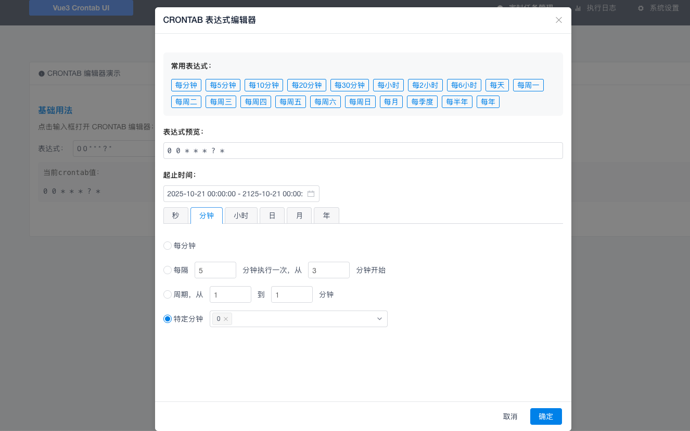

# Vue3 Crontab UI

<div align="center">


**A powerful CRONTAB expression visual editor based on Vue 3 + View UI Plus**

[中文文档](#中文文档) | [English Documentation](#english-documentation)



</div>

---

## English Documentation

## ✨ Features

### 🎯 Core Features
- ✅ **Complete 7-bit CRONTAB expression support** (seconds, minutes, hours, days, months, weeks, years) - Note: Second-level scheduling is restricted by default but can be enabled
- ✅ **Visual editing interface**: Intuitive tab-based operations
- ✅ **Multiple operation modes**: Per unit, periodic, interval, specified value, unspecified
- ✅ **Real-time expression preview**: Instant display of current expression
- ✅ **Quick common expression selection**: 20+ preset commonly used templates

### 🛠️ Advanced Features
- ✅ **Start/end time picker**: Support for task execution time range settings
- ✅ **Special date/week handling**: Support for special characters like L, W, #
- ✅ **Smart default values**: Reasonable default settings for different time units
- ✅ **Complete TypeScript support**: Type safety and intelligent hints
- ✅ **Vue 3 Composition API**: Modern development experience

### 🎨 User Experience
- ✅ **Responsive design**: Adapts to various screen sizes
- ✅ **Chinese localization**: Complete Chinese interface
- ✅ **Keyboard friendly**: Support for keyboard navigation
- ✅ **Error handling**: Expression validation and error prompts

## 🚀 Tech Stack

| Technology | Version | Description |
|------------|---------|-------------|
| **Vue** | 3.4.21 | Progressive JavaScript Framework |
| **Vite** | 5.2.8 | Modern Front-end Build Tool |
| **View UI Plus** | 1.3.15 | Enterprise Vue 3 UI Component Library |
| **TypeScript** | 5.4.0 | JavaScript superset providing type safety |
| **Day.js** | 1.11.18 | Lightweight date and time processing library |

## 📦 Installation and Usage

### Basic Usage

```vue
<template>
  <div class="demo">
    <CrontabEditor
      v-model="crontabValue"
      placeholder="Please select CRONTAB expression"
      @change="handleCrontabChange"
    />

    <div class="result">
      <p>Current expression: {{ crontabValue }}</p>
      <p v-if="dateRange">Execution time: {{ dateRange[0] }} to {{ dateRange[1] }}</p>
    </div>
  </div>
</template>

<script setup lang="ts">
import { ref } from 'vue'
import dayjs from 'dayjs'
import { CrontabEditor } from '@/components/crontab'

const crontabValue = ref('0 0 * * * ? *') // Default: execute every hour
const dateRange = ref<string[]>()

const handleCrontabChange = (data: { cron: string; dateRange?: (Date | null)[] | undefined }) => {
  crontabValue.value = data.cron

  // Handle time range
  if (data.dateRange && data.dateRange[0] && data.dateRange[1]) {
    dateRange.value = [
      dayjs(data.dateRange[0]).format("YYYY-MM-DD HH:mm:ss"),
      dayjs(data.dateRange[1]).format("YYYY-MM-DD HH:mm:ss")
    ]
  }

  console.log('CRONTAB expression:', data.cron)
  console.log('Time range:', dateRange.value)
}
</script>

<style scoped>
.demo {
  padding: 20px;
}

.result {
  margin-top: 20px;
  padding: 15px;
  background-color: #f8f9fa;
  border-radius: 6px;
  font-family: monospace;
}
</style>
```

### Advanced Usage

```vue
<template>
  <CrontabEditor
    v-model="advancedCrontab"
    :disabled="isDisabled"
    placeholder="Advanced CRONTAB expression"
    @change="onAdvancedChange"
  />
</template>

<script setup lang="ts">
import { ref } from 'vue'
import { CrontabEditor } from '@/components/crontab'

const advancedCrontab = ref('0 0 0 ? * MON *') // Execute every Monday
const isDisabled = ref(false)

const onAdvancedChange = (data) => {
  // Handle complex business logic
  console.log('Expression change:', data)

  // Add expression validation here
  if (!validateExpression(data.cron)) {
    console.error('Invalid CRONTAB expression')
    return
  }

  // Save to backend or other processing
  saveCrontabExpression(data)
}

const validateExpression = (expr: string): boolean => {
  // Custom validation logic
  return true
}

const saveCrontabExpression = async (data: any) => {
  // Async save logic
  try {
    await api.saveCrontab(data)
    console.log('Save successful')
  } catch (error) {
    console.error('Save failed:', error)
  }
}
</script>
```

## 📖 API Documentation

### Props

| Property | Type | Default | Description |
|----------|------|---------|-------------|
| `modelValue` | `string` | `'0 0 * * * ? *'` | CRONTAB expression value (two-way binding) |
| `disabled` | `boolean` | `false` | Whether to disable the component |
| `placeholder` | `string` | `'Please select CRONTAB expression'` | Input placeholder |

### Events

| Event | Parameter Type | Description |
|-------|----------------|-------------|
| `update:modelValue` | `(value: string)` | Triggered when expression value updates (v-model) |
| `change` | `{ cron: string; dateRange?: (Date \| null)[] \| undefined }` | Triggered when user confirms expression change |

#### Change Event Details

```typescript
interface CrontabChangeData {
  cron: string           // CRONTAB expression
  dateRange?: (Date | null)[] | undefined  // Start/end time array [startDate, endDate]
}
```

## 🏗️ Component Architecture

```
src/
├── components/
│   └── crontab/
│       ├── index.ts              # Component export entry
│       ├── types.ts              # Type definitions
│       ├── CrontabEditor.vue     # 🎯 Main editor component
│       ├── TimeUnitTab.vue       # 📊 Common time unit Tab (seconds/minutes/hours/months/years)
│       └── DayWeekTab.vue       # 📅 Date and week special handling Tab
├── utils/
│   └── common.ts                # 🔧 Utility functions and constants
├── types/
│   └── crontab.ts              # 📝 CRONTAB related type definitions
└── styles/
    └── main.css                # 🎨 Global styles
```

## 📋 Expression Format Description

### Standard 7-bit Format

```
┌── Seconds (0-59)
│  ┌── Minutes (0-59)
│  │  ┌── Hours (0-23)
│  │  │  ┌── Day (1-31)
│  │  │  │  ┌── Month (1-12)
│  │  │  │  │  ┌── Week (1-7, 1=Monday, 7=Sunday)
│  │  │  │  │  │  ┌── Year (2025-2130)
*  *  *  *  *  *  *
```

### Special Characters

| Character | Description | Example |
|-----------|-------------|---------|
| `*` | Any value | `*` Every minute |
| `?` | Unspecified (only for day and week) | `?` Unspecified date |
| `-` | Range | `1-5` 1st to 5th |
| `,` | List | `1,3,5` 1st, 3rd, 5th |
| `/` | Step | `0/15` Every 15 minutes |
| `L` | Last | `L` Last day of month |
| `W` | Workday | `15W` Nearest workday to 15th |
| `#` | Nth weekday | `1#2` Second Monday |

### 🎯 Common Expression Library

| Expression | Description | Notes |
|------------|-------------|-------|
| `0 * * * * ? *` | Every minute | Execute at 0 seconds |
| `0 5 * * * ? *` | Every 5 minutes | Execute at 5 minutes |
| `0 0 * * * ? *` | Every hour | Execute at 0 minutes 0 seconds |
| `0 0 0 * * ? *` | Every day | Execute at 0:00 |
| `0 0 0 ? * 2 *` | Every Monday | Execute at 0:00 on Monday |
| `0 0 0 1 * ? *` | 1st of every month | Execute at 0:00 on 1st |
| `0 0 0 1 1 ? *` | January 1st every year | Execute at 0:00 on New Year's Day |
| `0 0 0 ? * 1,5 *` | Every Monday and Friday | Execute at 0:00 on Monday and Friday |
| `0 0 0 L * ? *` | Last day of every month | Execute at 0:00 on last day |
| `0 0 0 ? * 6L *` | Last Saturday of every month | Execute at 0:00 on last Saturday |

## 🛠️ Development Guide

### Environment Requirements

- Node.js >= 16.0.0
- npm >= 7.0.0 or yarn >= 1.22.0

### Quick Start

```bash
# Clone project
git clone https://github.com/qindongliang/vue3-crontab-ui.git
cd vue3-crontab-ui

# Install dependencies
npm install

# Start development server
npm run dev

# Build production version
npm run build

# Preview build result
npm run preview

# Code formatting
npm run format

# Code checking
npm run lint
```

### Development Environment Configuration

The project uses the following development tools:

- **ESLint**: Code quality and style checking
- **Prettier**: Code formatting
- **TypeScript**: Type checking
- **Vite**: Build and development server

## 🔧 Customization and Extension

### Modify Time Unit Range

Edit the configuration in `src/components/crontab/TimeUnitTab.vue`:

```vue
<script setup lang="ts">
// Modify year range
const specificOptions = computed(() => {
  if (props.timeSpecial === 'year') {
    return Array.from({ length: 50 }, (_, i) => ({ // Change to 50 years
      label: (2025 + i).toString(),
      value: 2025 + i
    }))
  }
  // ... other configurations
})
</script>
```

### Add New Common Expressions

Edit `src/components/crontab/CrontabEditor.vue`:

```vue
<script setup lang="ts">
const COMMON_EXPRESSIONS = [
  // Existing expressions...

  // Add new expressions
  { label: 'Every weekday', value: '0 0 0 ? * MON-FRI *' },
  { label: 'Quarterly start', value: '0 0 0 1 1,4,7,10 ? *' },
  { label: 'Every 15 minutes', value: '0 0,15,30,45 * * * ? *' }
] as const
</script>
```

### Internationalization Support

Edit the `timeI18n` object in `src/utils/common.ts`:

```typescript
const timeI18n = {
  second: {
    everyTime: 'Every Second',    // English
    every: 'Every',
    timeCarriedOut: 'seconds, starting from',
    // ... other translations
  },
  // ... other time units
}
```

## 📱 Browser Compatibility

| Browser | Version |
|---------|---------|
| Chrome | >= 88 |
| Firefox | >= 78 |
| Safari | >= 14 |
| Edge | >= 88 |

## 🤝 Contributing

Issues and Pull Requests are welcome!

### Commit Specification

```bash
feat: new features
fix: bug fixes
docs: documentation updates
style: code format adjustments
refactor: code refactoring
test: testing related
chore: build process or auxiliary tool changes
```

### Development Workflow

1. Fork this repository
2. Create feature branch: `git checkout -b feature/amazing-feature`
3. Commit changes: `git commit -m 'feat: add amazing feature'`
4. Push branch: `git push origin feature/amazing-feature`
5. Submit Pull Request

## 📄 Changelog

### v1.0.0

#### ✨ New Features
- 🎉 CRONTAB editor based on Vue 3 + View UI Plus
- 📊 Complete 7-bit CRONTAB expression support
- 🎯 Visual tab editing interface
- ⚡ Quick common expression selection
- 📅 Start/end time picker
- 🔧 Real-time expression preview
- 📱 Responsive design
- 🎨 Complete TypeScript support

#### 🛠️ Technical Features
- Vue 3.4.21 + Composition API
- Vite 5.2.8 build
- View UI Plus 1.3.15 component library
- TypeScript 5.4.0 type safety
- Code optimization and streamlining

## 📄 License

This project is licensed under the [MIT](LICENSE) License.

## 🙏 Acknowledgments

- [Vue.js](https://vuejs.org/) - Progressive JavaScript Framework
- [View UI Plus](https://www.iviewui.com/) - Enterprise UI Component Library
- [Vite](https://vitejs.dev/) - Next Generation Front-end Build Tool
- [Day.js](https://day.js.org/) - Lightweight Date Library

---

<div align="center">

Made with ❤️ by [qindongliang](https://github.com/qindongliang)

If this project helps you, please give it a ⭐ Star!

</div>

---

## 中文文档

## ✨ 功能特性

### 🎯 核心功能
- ✅ **完整的 7 位 CRONTAB 表达式支持**（秒 分 时 日 月 周 年）备注：默认限制了秒级调度功能，可以自行打开每秒，间隔，区间功能
- ✅ **可视化编辑界面**：直观的 Tab 页面操作
- ✅ **多种操作模式**：每单位、周期、间隔、指定值、不指定
- ✅ **实时表达式预览**：即时显示当前表达式
- ✅ **常用表达式快速选择**：20+ 预设常用模板

### 🛠️ 高级功能
- ✅ **起止时间选择器**：支持任务执行时间范围设置
- ✅ **日期星期特殊处理**：L、W、# 等特殊字符支持
- ✅ **智能默认值**：不同时间单位的合理默认设置
- ✅ **完全的 TypeScript 支持**：类型安全和智能提示
- ✅ **Vue 3 组合式 API**：现代化的开发体验

### 🎨 用户体验
- ✅ **响应式设计**：适配各种屏幕尺寸
- ✅ **中文本地化**：完整的中文界面
- ✅ **键盘友好**：支持键盘导航操作
- ✅ **错误处理**：表达式验证和错误提示

## 🚀 技术栈

| 技术 | 版本 | 说明 |
|------|------|------|
| **Vue** | 3.4.21 | 渐进式 JavaScript 框架 |
| **Vite** | 5.2.8 | 现代化的前端构建工具 |
| **View UI Plus** | 1.3.15 | 企业级 Vue 3 UI 组件库 |
| **TypeScript** | 5.4.0 | JavaScript 的超集，提供类型安全 |
| **Day.js** | 1.11.18 | 轻量级日期时间处理库 |

## 📦 安装和使用

### 基础用法

```vue
<template>
  <div class="demo">
    <CrontabEditor
      v-model="crontabValue"
      placeholder="请选择 CRONTAB 表达式"
      @change="handleCrontabChange"
    />

    <div class="result">
      <p>当前表达式：{{ crontabValue }}</p>
      <p v-if="dateRange">执行时间：{{ dateRange[0] }} 到 {{ dateRange[1] }}</p>
    </div>
  </div>
</template>

<script setup lang="ts">
import { ref } from 'vue'
import dayjs from 'dayjs'
import { CrontabEditor } from '@/components/crontab'

const crontabValue = ref('0 0 * * * ? *') // 默认每小时执行
const dateRange = ref<string[]>()

const handleCrontabChange = (data: { cron: string; dateRange?: (Date | null)[] | undefined }) => {
  crontabValue.value = data.cron

  // 处理时间范围
  if (data.dateRange && data.dateRange[0] && data.dateRange[1]) {
    dateRange.value = [
      dayjs(data.dateRange[0]).format("YYYY-MM-DD HH:mm:ss"),
      dayjs(data.dateRange[1]).format("YYYY-MM-DD HH:mm:ss")
    ]
  }

  console.log('CRONTAB 表达式:', data.cron)
  console.log('时间范围:', dateRange.value)
}
</script>

<style scoped>
.demo {
  padding: 20px;
}

.result {
  margin-top: 20px;
  padding: 15px;
  background-color: #f8f9fa;
  border-radius: 6px;
  font-family: monospace;
}
</style>
```

### 高级用法

```vue
<template>
  <CrontabEditor
    v-model="advancedCrontab"
    :disabled="isDisabled"
    placeholder="高级 CRONTAB 表达式"
    @change="onAdvancedChange"
  />
</template>

<script setup lang="ts">
import { ref } from 'vue'
import { CrontabEditor } from '@/components/crontab'

const advancedCrontab = ref('0 0 0 ? * MON *') // 每周一执行
const isDisabled = ref(false)

const onAdvancedChange = (data) => {
  // 处理复杂的业务逻辑
  console.log('表达式变更:', data)

  // 可以在这里添加表达式验证
  if (!validateExpression(data.cron)) {
    console.error('无效的 CRONTAB 表达式')
    return
  }

  // 保存到后端或其他处理
  saveCrontabExpression(data)
}

const validateExpression = (expr: string): boolean => {
  // 自定义验证逻辑
  return true
}

const saveCrontabExpression = async (data: any) => {
  // 异步保存逻辑
  try {
    await api.saveCrontab(data)
    console.log('保存成功')
  } catch (error) {
    console.error('保存失败:', error)
  }
}
</script>
```

## 📖 API 文档

### Props

| 属性名 | 类型 | 默认值 | 说明 |
|--------|------|--------|------|
| `modelValue` | `string` | `'0 0 * * * ? *'` | CRONTAB 表达式值（双向绑定） |
| `disabled` | `boolean` | `false` | 是否禁用组件 |
| `placeholder` | `string` | `'请选择 CRONTAB 表达式'` | 输入框占位符 |

### Events

| 事件名 | 参数类型 | 说明 |
|--------|----------|------|
| `update:modelValue` | `(value: string)` | 表达式值更新时触发（v-model） |
| `change` | `{ cron: string; dateRange?: (Date \| null)[] \| undefined }` | 用户确认表达式变更时触发 |

#### Change 事件详细说明

```typescript
interface CrontabChangeData {
  cron: string           // CRONTAB 表达式
  dateRange?: (Date | null)[] | undefined  // 起止时间数组 [startDate, endDate]
}
```

## 🏗️ 组件架构

```
src/
├── components/
│   └── crontab/
│       ├── index.ts              # 组件导出入口
│       ├── types.ts              # 类型定义
│       ├── CrontabEditor.vue     # 🎯 主编辑器组件
│       ├── TimeUnitTab.vue       # 📊 通用时间单位 Tab（秒/分/时/月/年）
│       └── DayWeekTab.vue       # 📅 日期和星期特殊处理 Tab
├── utils/
│   └── common.ts                # 🔧 工具函数和常量
├── types/
│   └── crontab.ts              # 📝 CRONTAB 相关类型定义
└── styles/
    └── main.css                # 🎨 全局样式
```

## 📋 表达式格式说明

### 标准 7 位格式

```
┌── 秒 (0-59)
│  ┌── 分 (0-59)
│  │  ┌── 时 (0-23)
│  │  │  ┌── 日 (1-31)
│  │  │  │  ┌── 月 (1-12)
│  │  │  │  │  ┌── 周 (1-7, 1=周一, 7=周日)
│  │  │  │  │  │  ┌── 年 (2025-2130)
*  *  *  *  *  *  *
```

### 特殊字符说明

| 字符 | 说明 | 示例 |
|------|------|------|
| `*` | 任意值 | `*` 每分钟 |
| `?` | 不指定（仅用于日和周） | `?` 不指定具体日期 |
| `-` | 范围 | `1-5` 1号到5号 |
| `,` | 列表 | `1,3,5` 1号、3号、5号 |
| `/` | 步长 | `0/15` 每15分钟 |
| `L` | 最后 | `L` 当月最后一天 |
| `W` | 工作日 | `15W` 离15号最近的工作日 |
| `#` | 第几个星期几 | `1#2` 第二个周一 |

### 🎯 常用表达式库

| 表达式 | 说明 | 备注 |
|--------|------|------|
| `0 * * * * ? *` | 每分钟 | 在第0秒执行 |
| `0 5 * * * ? *` | 每5分钟 | 在第5分钟执行 |
| `0 0 * * * ? *` | 每小时 | 在0分0秒执行 |
| `0 0 0 * * ? *` | 每天 | 在0点执行 |
| `0 0 0 ? * 2 *` | 每周一 | 周一0点执行 |
| `0 0 0 1 * ? *` | 每月1号 | 每月1号0点执行 |
| `0 0 0 1 1 ? *` | 每年1月1号 | 元旦0点执行 |
| `0 0 0 ? * 1,5 *` | 每周一和周五 | 周一和周五0点执行 |
| `0 0 0 L * ? *` | 每月最后一天 | 当月最后一天0点执行 |
| `0 0 0 ? * 6L *` | 每月最后一个周六 | 当月最后一个周六0点执行 |

## 🛠️ 开发指南

### 环境要求

- Node.js >= 16.0.0
- npm >= 7.0.0 或 yarn >= 1.22.0

### 快速开始

```bash
# 克隆项目
git clone https://github.com/qindongliang/vue3-crontab-ui.git
cd vue3-crontab-ui

# 安装依赖
npm install

# 启动开发服务器
npm run dev

# 构建生产版本
npm run build

# 预览构建结果
npm run preview

# 代码格式化
npm run format

# 代码检查
npm run lint
```

### 开发环境配置

项目使用以下开发工具：

- **ESLint**: 代码质量和风格检查
- **Prettier**: 代码格式化
- **TypeScript**: 类型检查
- **Vite**: 构建和开发服务器

## 🔧 自定义和扩展

### 修改时间单位范围

编辑 `src/components/crontab/TimeUnitTab.vue` 中的配置：

```vue
<script setup lang="ts">
// 修改年份范围
const specificOptions = computed(() => {
  if (props.timeSpecial === 'year') {
    return Array.from({ length: 50 }, (_, i) => ({ // 改为50年
      label: (2025 + i).toString(),
      value: 2025 + i
    }))
  }
  // ... 其他配置
})
</script>
```

### 添加新的常用表达式

编辑 `src/components/crontab/CrontabEditor.vue`：

```vue
<script setup lang="ts">
const COMMON_EXPRESSIONS = [
  // 现有表达式...

  // 添加新的表达式
  { label: '每工作日', value: '0 0 0 ? * MON-FRI *' },
  { label: '每季度初', value: '0 0 0 1 1,4,7,10 ? *' },
  { label: '每15分钟', value: '0 0,15,30,45 * * * ? *' }
] as const
</script>
```

### 国际化支持

编辑 `src/utils/common.ts` 中的 `timeI18n` 对象：

```typescript
const timeI18n = {
  second: {
    everyTime: 'Every Second',    // 英文
    every: 'Every',
    timeCarriedOut: 'seconds, starting from',
    // ... 其他翻译
  },
  // ... 其他时间单位
}
```

## 📱 浏览器兼容性

| 浏览器 | 版本 |
|--------|------|
| Chrome | >= 88 |
| Firefox | >= 78 |
| Safari | >= 14 |
| Edge | >= 88 |

## 🤝 贡献指南

欢迎提交 Issue 和 Pull Request！

### 提交规范

```bash
feat: 新功能
fix: 修复问题
docs: 文档更新
style: 代码格式调整
refactor: 代码重构
test: 测试相关
chore: 构建过程或辅助工具的变动
```

### 开发流程

1. Fork 本仓库
2. 创建功能分支: `git checkout -b feature/amazing-feature`
3. 提交更改: `git commit -m 'feat: add amazing feature'`
4. 推送分支: `git push origin feature/amazing-feature`
5. 提交 Pull Request

## 📄 更新日志

### v1.0.0

#### ✨ 新增功能
- 🎉 基于 Vue 3 + View UI Plus 的 CRONTAB 编辑器
- 📊 完整的 7 位 CRONTAB 表达式支持
- 🎯 可视化 Tab 编辑界面
- ⚡ 常用表达式快速选择
- 📅 起止时间选择器
- 🔧 实时表达式预览
- 📱 响应式设计
- 🎨 完整的 TypeScript 支持

#### 🛠️ 技术特性
- Vue 3.4.21 + Composition API
- Vite 5.2.8 构建
- View UI Plus 1.3.15 组件库
- TypeScript 5.4.0 类型安全
- 代码优化和精简

## 📄 许可证

本项目采用 [MIT](LICENSE) 许可证。

## 🙏 致谢

- [Vue.js](https://vuejs.org/) - 渐进式 JavaScript 框架
- [View UI Plus](https://www.iviewui.com/) - 企业级 UI 组件库
- [Vite](https://vitejs.dev/) - 下一代前端构建工具
- [Day.js](https://day.js.org/) - 轻量级日期库

---

<div align="center">

Made with ❤️ by [qindongliang](https://github.com/qindongliang)

如果这个项目对你有帮助，请给个 ⭐ Star 支持一下！

</div>
